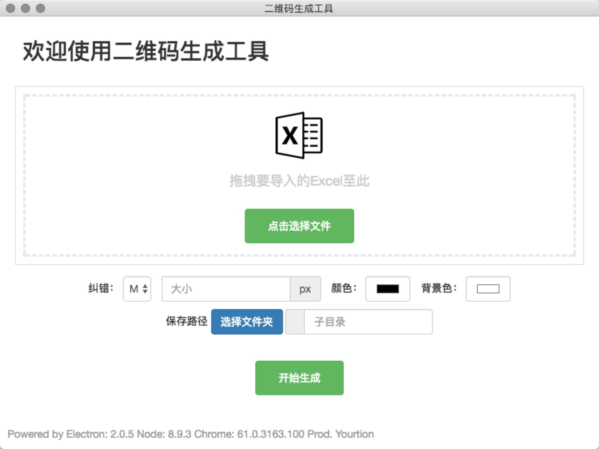

# Electron-BatchCreateQRCode

链接二维码批量生成工具

下载地址：https://github.com/yourtion/Electron-BatchCreateQRCode/releases

- [Mac](https://github.com/yourtion/Electron-BatchCreateQRCode/releases/download/v0.3.0/batch-create-qrcode-0.3.0-mac.zip)
- [Windows](https://github.com/yourtion/Electron-BatchCreateQRCode/releases/download/v0.3.0/batch-create-qrcode-setup-0.3.0.exe)
- [Linux(deb)](https://github.com/yourtion/Electron-BatchCreateQRCode/releases/download/v0.3.0/batch-create-qrcode_0.3.0_amd64.deb)

## 说明

生成二维码的 Excel 文件第一个表格第一列为二维码内容，会判断是不是 url，如果不是 url 会跳过。
